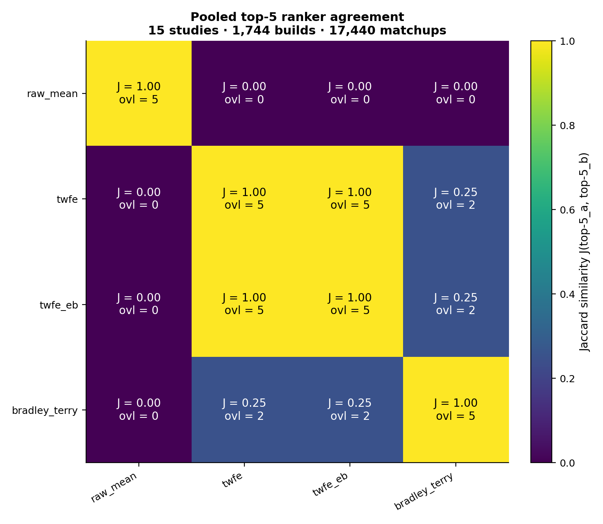
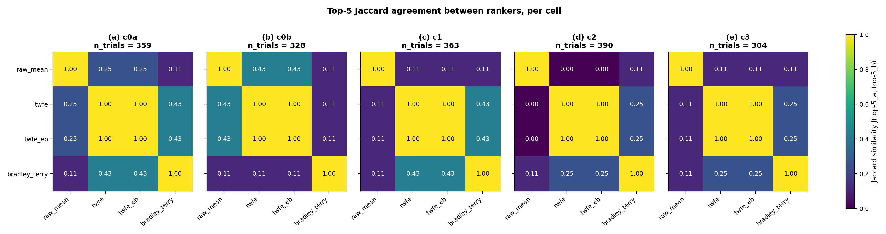
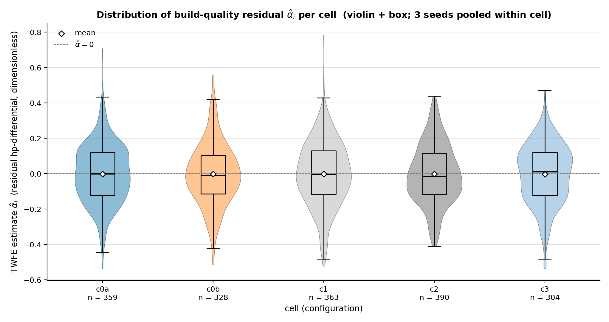
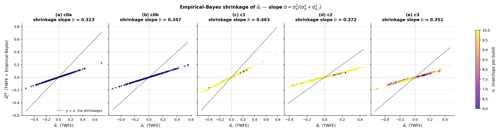
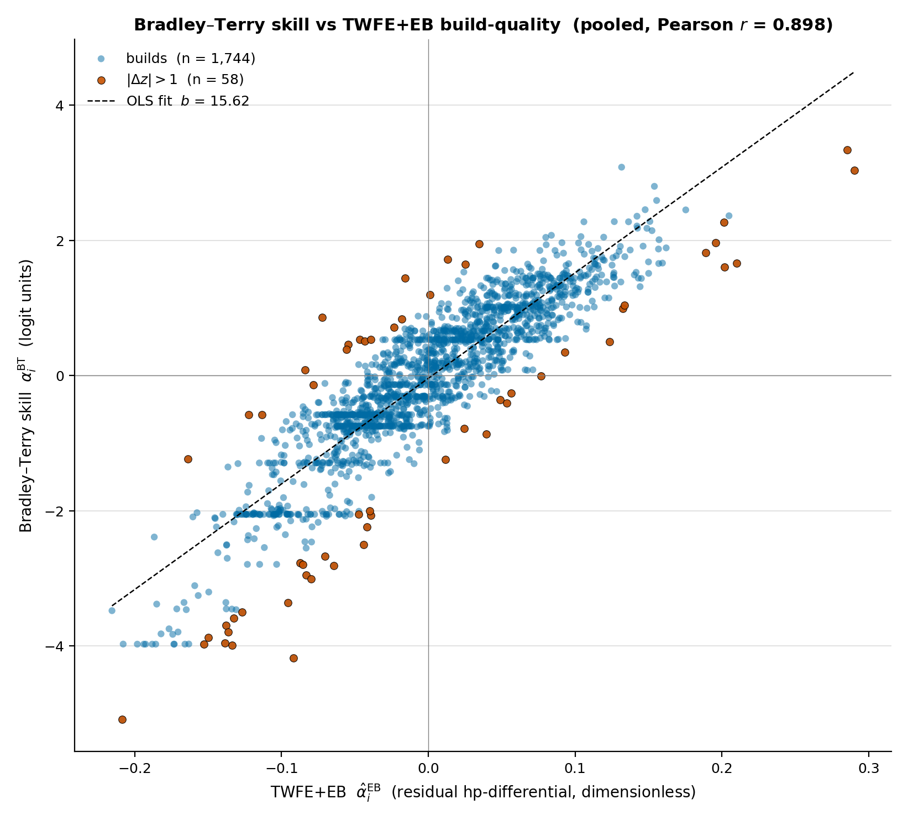
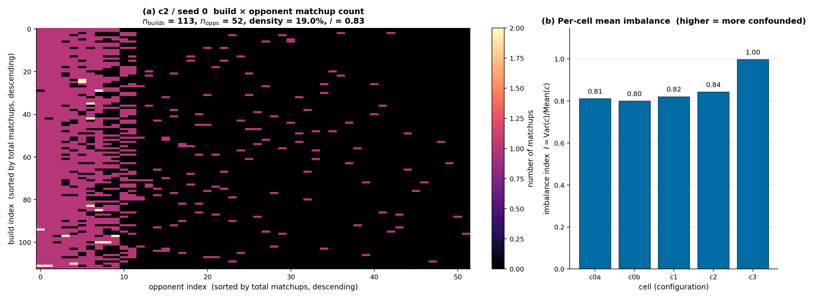
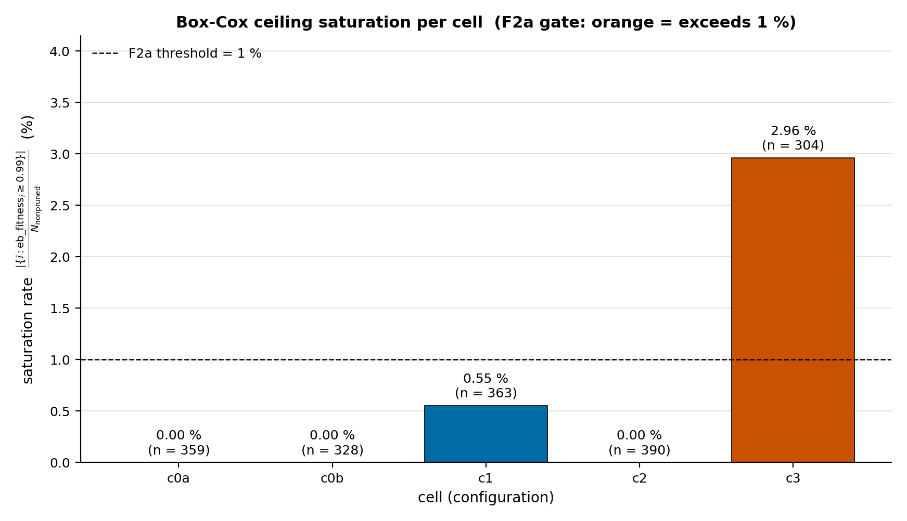
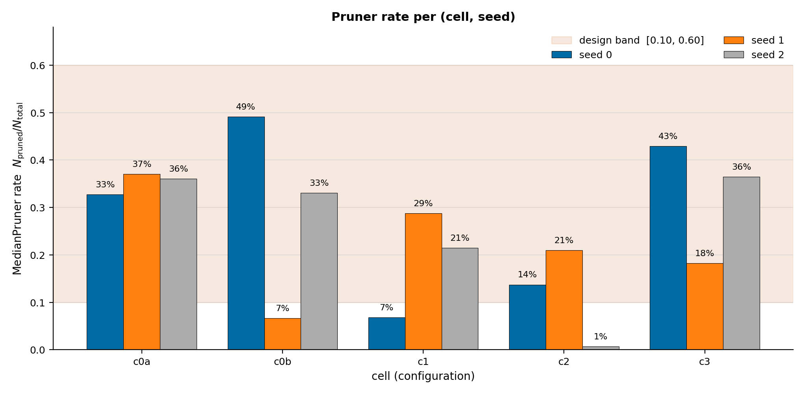
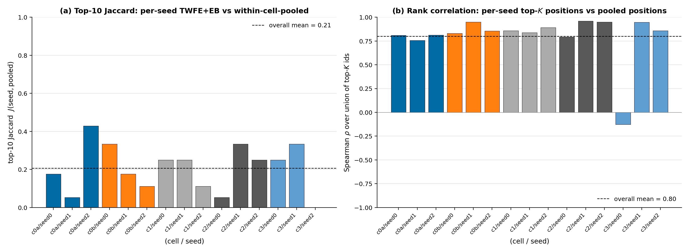
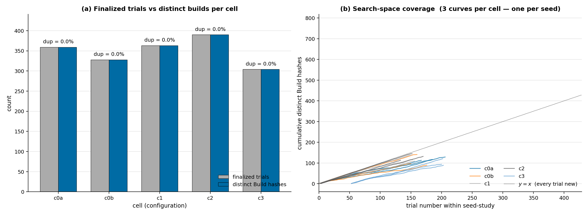

# Wave 1 — Training-Log Ranker and Diagnostic Analysis

## Abstract

This report is a post-hoc analysis of Wave 1 training logs, not the honest-eval verdict. It compares raw mean, TWFE, TWFE+EB, and Bradley-Terry rankers on 1,744 finalized Hammerhead/early builds from 15 studies. The central result is that raw mean is unsafe for candidate selection in this dataset: pooled top-5 overlap with TWFE, TWFE+EB, and Bradley-Terry is 0/5, while TWFE and TWFE+EB are rank-identical at top-10 and nearly identical over the full pool (Spearman rho = 0.9995). Supplemental training-time cell diagnostics do not support the production c2 stack beating the baselines: c2's top-3 mean TWFE+EB alpha is below both c0a and c0b at the point estimate, with bootstrap CIs spanning zero. c1 is the strongest cell by this training-log metric. c3 remains suspect because it combines high opponent-panel imbalance, poor seed-to-pooled rank stability, and elevated EB-fitness ceiling concentration.

This report complements [2026-05-10-wave1-validation.md](2026-05-10-wave1-validation.md). Official gate verdicts remain in the validation report; the measurements here are training-log diagnostics and priors for honest evaluation.

## 1. Methods

### 1.1 Data

Inputs are `data/logs/wave1-{c0a,c0b,c1,c2,c3}/hammerhead__early__tpe__seed{0,1,2}/evaluation_log.jsonl`. The ranker sample is the 1,744 rows accepted by `posthoc_ranker.load_records`: non-pruned, non-cache, non-invalid rows with a build and opponent results. These rows contain 17,440 build-opponent matchup observations. Positive `hp_differential` means a better player/build outcome; negative means a worse player/build outcome.

The cells are:

| cell | role |
|---|---|
| c0a | A0 baseline, no scalar-CV trim |
| c0b | A baseline, scalar-CV trim |
| c1 | EB shrinkage, no Box-Cox |
| c2 | production stack: EB + Box-Cox |
| c3 | c2 + warm-start |

### 1.2 Estimators

All rankers are implemented in `src/starsector_optimizer/posthoc_ranker.py`.

**Raw mean** scores each build by the unconditioned mean of its observed `hp_differential` values. It is vulnerable to opponent-schedule imbalance.

**TWFE** fits `y_ij = mu + alpha_i + beta_j + epsilon_ij`, where `alpha_i` is build quality and `beta_j` absorbs opponent strength.

**TWFE+EB** shrinks TWFE build effects toward the empirical prior: `alpha_eb = alpha * sigma_alpha^2 / (sigma_alpha^2 + sigma_e^2)`.

**Bradley-Terry MAP** fits a label-only win/draw/loss skill model with build and opponent skills. It is a corroborating model, not the production oracle.

### 1.3 Statistics

Top-K overlap is set intersection size. Jaccard is intersection over union. `posthoc_ranker.spearman_rho` computes Spearman rho over common ranked build IDs. The pooling-stability section uses its own union-of-top-K rank comparison.

The F1c-style diagnostic in this report bootstraps rows within each cell 5,000 times (`BOOTSTRAP_SEED = 0xC0DE`), refits TWFE+EB, and compares mean top-3 `alpha_eb`. This is not the validation report's official LOOO-rho gate; it is a separate training-time magnitude check.

### 1.4 Diagnostics

Opponent imbalance is `Var(C) / Mean(C)` over the build-by-opponent count matrix. EB-fitness ceiling concentration is the finalized-row rate where `eb_fitness >= 0.99`; this is not the official Box-Cox `fitness >= 0.99` saturation gate used in [2026-05-10-wave1-validation.md](2026-05-10-wave1-validation.md). Pruner rate is `N_pruned / N_total` over JSONL rows. Search coverage counts distinct finalized build hashes among logged rows.

Reproducibility artifacts:

- Producer: `scripts/analysis/wave1_comprehensive_analysis.py`
- Numbers: `data/wave1-comprehensive/headline_numbers.json`
- Charts: `data/wave1-comprehensive/charts/*.png`

## 2. Ranker Agreement

### 2.1 Pooled agreement

| ranker pair | k=3 overlap | k=5 overlap | k=10 overlap | full-pool Spearman rho |
|---|---:|---:|---:|---:|
| raw_mean vs TWFE | 0 / 3 | 0 / 5 | 2 / 10 | 0.768 |
| raw_mean vs TWFE+EB | 0 / 3 | 0 / 5 | 2 / 10 | 0.767 |
| raw_mean vs Bradley-Terry | 0 / 3 | 0 / 5 | 1 / 10 | 0.702 |
| TWFE vs TWFE+EB | 3 / 3 | 5 / 5 | 10 / 10 | 0.9995 |
| TWFE vs Bradley-Terry | 2 / 3 | 2 / 5 | 4 / 10 | 0.902 |
| TWFE+EB vs Bradley-Terry | 2 / 3 | 2 / 5 | 4 / 10 | 0.902 |

Raw mean selects a different top set from all three principled rankers. This is consistent with severe opponent-panel imbalance (§5.1). TWFE and TWFE+EB make the same top-10 selections; EB is primarily changing uncertainty and magnitude, not top-K identity, because matchup counts are nearly uniform.

### 2.2 Per-cell agreement

| cell | finalized builds | raw vs TWFE top-5 Jaccard | raw vs TWFE+EB | raw vs BT | TWFE+EB vs BT |
|---|---:|---:|---:|---:|---:|
| c0a | 359 | 0.25 | 0.25 | 0.11 | 0.43 |
| c0b | 328 | 0.43 | 0.43 | 0.11 | 0.11 |
| c1 | 363 | 0.11 | 0.11 | 0.11 | 0.43 |
| c2 | 390 | 0.00 | 0.00 | 0.11 | 0.25 |
| c3 | 304 | 0.11 | 0.11 | 0.11 | 0.25 |

c2 is the strongest warning case: raw mean has 0/5 top-5 overlap with TWFE or TWFE+EB inside the production cell.

## 3. Training-Time Cell Comparison

### 3.1 Top-3 TWFE+EB magnitude

| cell | top-3 mean TWFE+EB alpha | top-3 mean BT skill |
|---|---:|---:|
| c0a | 0.168 | 2.34 |
| c0b | 0.186 | 2.19 |
| c1 | 0.270 | 2.57 |
| c2 | 0.158 | 2.44 |
| c3 | 0.142 | 2.07 |

c1 is the best training-log cell at the point estimate. c2 is fourth by TWFE+EB alpha and does not beat either baseline on this metric.

### 3.2 Supplemental bootstrap comparison

| comparison | delta point | 95% bootstrap CI | producer branch |
|---|---:|---:|---|
| c2 - c0a | -0.010 | [-0.069, +0.078] | F1c |
| c2 - c0b | -0.028 | [-0.081, +0.052] | F1c |

The producer branch is F1c because both point estimates are negative. The CIs also span zero, so the conservative interpretation is simpler: c2 has no demonstrated training-time advantage over either baseline.

## 4. Estimator Calibration

### 4.1 TWFE alpha distributions

| cell | n | mean | std | min | max | p05 | p95 |
|---|---:|---:|---:|---:|---:|---:|---:|
| c0a | 359 | -0.001 | 0.166 | -0.54 | 0.71 | -0.25 | 0.25 |
| c0b | 328 | -0.001 | 0.174 | -0.51 | 0.56 | -0.28 | 0.31 |
| c1 | 363 | -0.001 | 0.183 | -0.52 | 0.78 | -0.29 | 0.28 |
| c2 | 390 | -0.002 | 0.168 | -0.41 | 0.44 | -0.28 | 0.29 |
| c3 | 304 | -0.004 | 0.168 | -0.54 | 0.47 | -0.31 | 0.25 |

c1 has the widest TWFE spread and highest maximum, consistent with its top-3 lead. c2 and c3 have compressed upper tails in the underlying deconfounded signal.

### 4.2 EB shrinkage

| cell | shrinkage slope | mean matches per build |
|---|---:|---:|
| c0a | 0.323 | 10.00 |
| c0b | 0.347 | 10.00 |
| c1 | 0.463 | 9.95 |
| c2 | 0.372 | 9.85 |
| c3 | 0.351 | 9.09 |

EB contracts noisy point estimates by roughly 0.32-0.46. Residual diagnostics are well behaved: mean z is approximately 0 in every cell, std is 0.73-0.82, and max absolute z is at most 3.53. There is no evidence of an EB failure mode in Wave 1.

### 4.3 Bradley-Terry corroboration

Bradley-Terry and TWFE+EB correlate strongly over the full pool (Pearson r = 0.898). They are not top-K identical: top-5 overlap is 2/5. The label-only model therefore corroborates the broad deconfounded ranking but should not replace TWFE+EB for candidate selection.

## 5. Failure-Mode Diagnostics

### 5.1 Opponent-panel imbalance

| cell | mean imbalance |
|---|---:|
| c0a | 0.811 |
| c0b | 0.800 |
| c1 | 0.821 |
| c2 | 0.844 |
| c3 | 0.998 |

All cells are imbalanced enough that raw means should not be trusted. c3 is the worst case, with one seed at imbalance 1.117.

### 5.2 EB-fitness ceiling concentration

| cell | finalized | `eb_fitness >= 0.99` | rate |
|---|---:|---:|---:|
| c0a | 359 | 0 | 0.00% |
| c0b | 328 | 0 | 0.00% |
| c1 | 363 | 2 | 0.55% |
| c2 | 390 | 0 | 0.00% |
| c3 | 304 | 9 | 2.96% |

This is a supplemental EB-fitness diagnostic. The official Box-Cox saturation gate in the validation report uses shaped `fitness`; by that definition, c2 is the official saturation failure. The split matters: c2 has shaped-objective saturation without EB-fitness ceiling concentration, while c3 has EB-fitness ceiling concentration as well.

### 5.3 Pruner rates

| cell | pruned | total | rate |
|---|---:|---:|---:|
| c0a | 197 | 556 | 35.4% |
| c0b | 145 | 473 | 30.7% |
| c1 | 86 | 449 | 19.2% |
| c2 | 54 | 444 | 12.2% |
| c3 | 148 | 452 | 32.7% |

Pruner rate falls from c0a to c2, then rises again in c3. c3 is second-highest, not highest. The c3 increase is consistent with warm-start changing the population the pruner sees, but this report does not prove the mechanism.

### 5.4 Seed-to-pooled stability

| cell | mean top-10 Jaccard | mean rank rho |
|---|---:|---:|
| c0a | 0.22 | 0.79 |
| c0b | 0.21 | 0.88 |
| c1 | 0.20 | 0.86 |
| c2 | 0.21 | 0.90 |
| c3 | 0.19 | 0.56 |

Single-seed top-10 membership is unstable in every cell. c3 is uniquely concerning because its mean rho is low and one seed is anti-correlated with the cell-pooled ranking.

### 5.5 Logged search coverage

| cell | finalized | distinct logged builds | duplicate rate |
|---|---:|---:|---:|
| c0a | 359 | 359 | 0.00% |
| c0b | 328 | 328 | 0.00% |
| c1 | 363 | 363 | 0.00% |
| c2 | 390 | 390 | 0.00% |
| c3 | 304 | 304 | 0.00% |

Among logged finalized rows, every build hash is distinct. Because Wave 1 lacks cache-hit logging, this does not prove TPE never re-proposed a cached build; it only rules out duplicates among logged finalized records.

## 6. Conclusions

1. Raw mean is not fit for Wave 1 candidate selection. Severe opponent imbalance and 0/5 pooled top-5 overlap with TWFE+EB make this a structural issue, not a cosmetic rank difference.
2. TWFE+EB is the best training-log ranker in this analysis. It preserves TWFE ranking while providing shrinkage-calibrated magnitudes, and Bradley-Terry broadly corroborates it.
3. The production c2 stack does not beat c0a or c0b on the supplemental top-3 TWFE+EB metric, and c1 is the point-estimate leader.
4. c3 should be treated as unstable as tested. It has the worst imbalance, poor seed-to-pooled rank stability, and elevated EB-fitness ceiling concentration.
5. Honest evaluation remains the decision source for out-of-sample build quality. The key questions are whether c1's training-time lead survives, whether TWFE+EB-selected per-seed candidates beat raw-mean candidates, and whether c3 should be excluded or rerun with a different warm-start/shape configuration.

## Appendix A. File Map

- Producer: `scripts/analysis/wave1_comprehensive_analysis.py`
- Headline numbers: `data/wave1-comprehensive/headline_numbers.json`
- Charts: `data/wave1-comprehensive/charts/`
- Input logs: `data/logs/wave1-{cell}/hammerhead__early__tpe__seed{seed}/evaluation_log.jsonl`
- Ranker module: `src/starsector_optimizer/posthoc_ranker.py`
