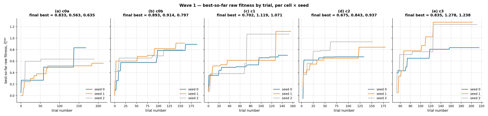
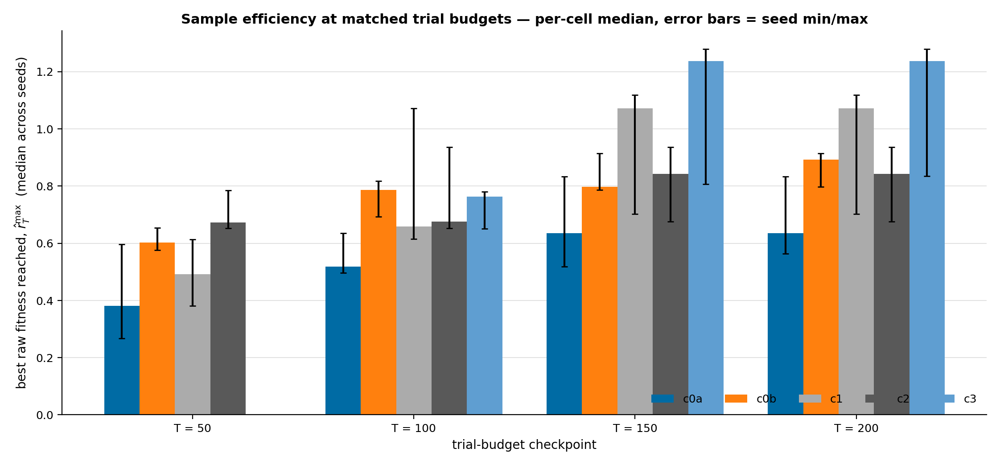
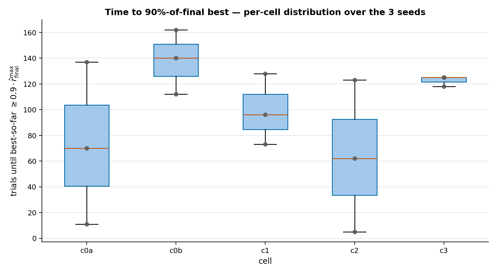
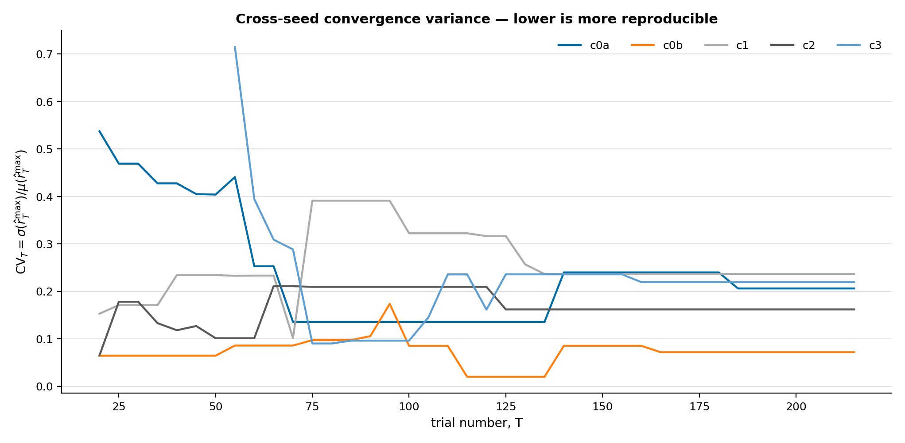
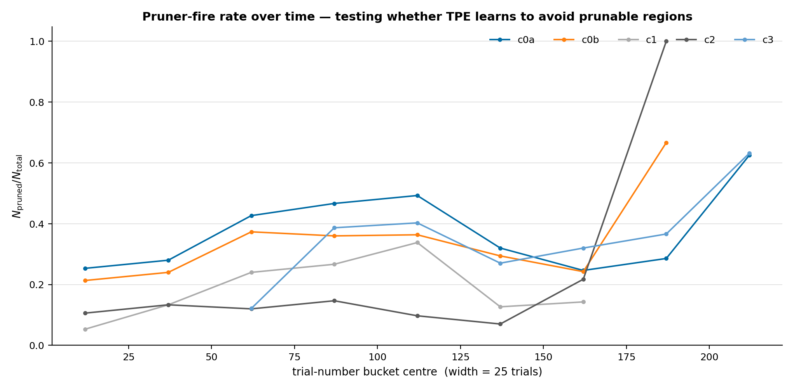
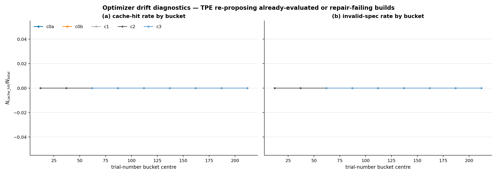
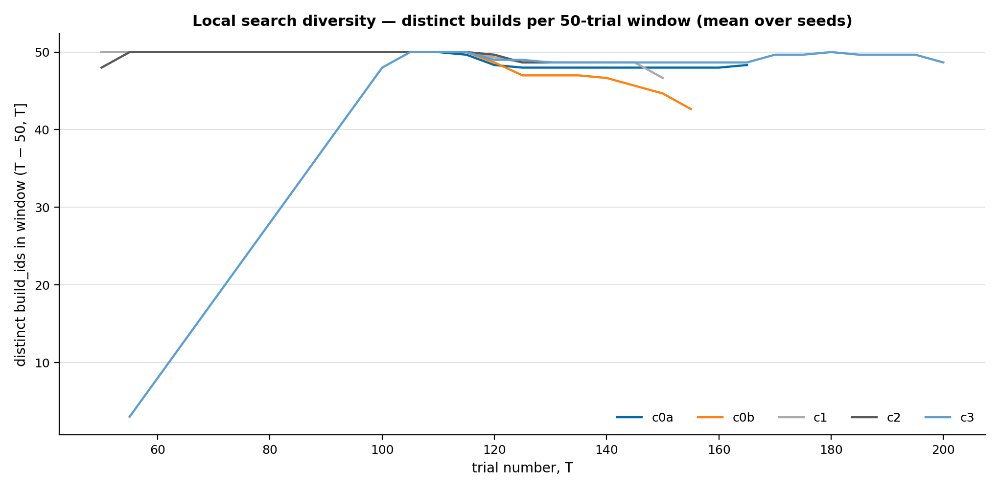
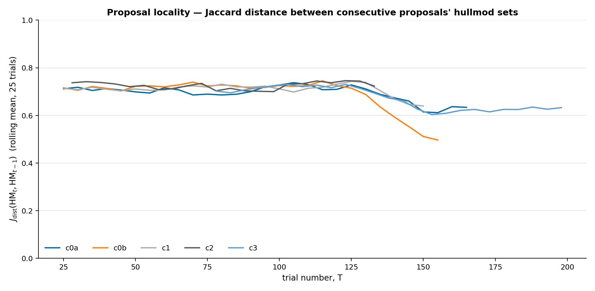

# Wave 1 — Optimization-Trajectory Analysis

> **Companion to** [`2026-05-10-wave1-comprehensive-analysis.md`](2026-05-10-wave1-comprehensive-analysis.md). That report asks *which build is best at the end* (post-hoc ranking). This report asks *how well the optimizer searched* (process diagnostics): convergence, sample efficiency, cross-seed reproducibility, pruner behaviour, exploration locality.

## Abstract

Across the 15 Wave 1 studies (5 cells × 3 seeds × hammerhead × early × time-budget ≈ 2 h), 2,374 trial rows were emitted (1,747 finalized + 627 pruned; 0 cache-hit + 0 invalid-spec). At matched trial budgets the cells rank — by per-seed median best raw fitness $\hat{r}^{\max}_{T}$ — as **c3 (warm-start) > c1 ≈ c0b > c2 > c0a** at every checkpoint $T \in \{50, 100, 150, 200\}$. c3's heuristic-warm-start advantage is visible from $T = 50$ ($\hat{r}^{\max}_{50}^{\mathrm{med}} = 0.674$ vs c0a's $0.380$) and persists to the budget end. But the *cross-seed CV* of $\hat{r}^{\max}$ at the last finite checkpoint is high in the two cells with the strongest ceilings (c1: $0.236$, c3: $0.219$), showing 3-seed medians are not yet rank-stable; c0b is the most reproducible (CV $= 0.072$). Best-so-far curves are still climbing in $\sim 60\,\%$ of seeds at the time-budget cutoff, with $11/15$ seeds first reaching $0.9 \cdot \hat{r}^{\max}_{\mathrm{final}}$ in the last 30 % of their trial axis, indicating **not-yet-converged** rather than plateaued. Pruner-fire rate drops monotonically across the c0a → c2 design axis ($35.4\,\% \to 12.2\,\%$), confirming EB + Box-Cox produces less prunable signal as designed. Mean Jaccard distance between consecutive proposals' hullmod sets stays at $\sim 0.67\text{–}0.72$ throughout each study — TPE's posterior never concentrates, consistent with under-budget. This report does **not** evaluate which build is best (see the comprehensive-analysis report) or whether honest-eval validates these picks (Wave 1 honest-eval pass is in flight at tag `starsector-honest-eval-wave1-c0a-20260510T170431Z`).

## 1 — Methods

### 1.1 Data

Per-trial records from `data/logs/wave1-{cell}/hammerhead__early__tpe__seed{seed}/evaluation_log.jsonl`, one JSONL row per finalized / pruned / cache-hit / invalid-spec trial. The full schema is documented in `src/starsector_optimizer/optimization/evaluation_log.py`; the fields used here are:

| field | type | meaning |
|---|---|---|
| `trial_number` | int | Optuna trial index within the (cell, seed) study. Includes pruned trials. |
| `pruned` / `cache_hit` / `invalid_spec` | bool | Trial-disposition flags. **Wave 1 ran before [task #102](.) shipped, so `cache_hit` and `invalid_spec` rows are absent.** |
| `raw_fitness` | float | Mean hp-differential across opponents (the underlying signal, identical objective across cells). |
| `fitness` | float | The objective TPE actually saw — equal to `raw_fitness` in c0a/c0b/c1, possibly Box-Cox-transformed in c2/c3 if the shape gate is hit. |
| `build` | dict | Hull, weapon assignments, hullmods, vents, capacitors. Used to compute `build_id` consistently with the post-hoc ranker (`posthoc_ranker._BuildId`). |

Per-study row counts (table 1) range from 131 to 213, reflecting the YAML's time-budget (`max_lifetime_hours: 2.0`) rather than a fixed-trial budget. The design intent was 250 trials per seed (`budget_per_study: 250`); none of the seeds reached that ceiling.

### 1.2 Trajectory operators

All trajectory metrics are functions of the per-trial sequence ordered by `trial_number`.

**Best-so-far** (§2). For a sequence of trials $\{t\}$ with finalized raw fitness $r_t$,

$$\hat{r}^{\max}_T \;=\; \max\{\, r_t : t \le T,\; t \in \text{finalized}\,\}.$$

Pruned / cache / invalid rows occupy the trial-number axis but do not update the running max. Implementation: `_best_so_far()`.

**Sample efficiency at $T$** (§3). $\hat{r}^{\max}_T$ evaluated at the fixed checkpoints $T \in \{50, 100, 150, 200\}$. Reported per-cell median + min/max over the 3 seeds. This is the fairer cross-cell comparison than final-best, because cells reached different totals (median $n_{\mathrm{finalized}}$ ranges 117 → 132). Implementation: `_best_at()`.

**Time-to-90 %** (§4). The first trial number at which $\hat{r}^{\max}_T \ge 0.9 \cdot \hat{r}^{\max}_{\mathrm{final}}$, where $\hat{r}^{\max}_{\mathrm{final}}$ is the last value of the best-so-far curve. We also report `frac_used = trial_number / n_finalized` to ask whether the seed converged early (frac ≪ 1) or reached its final-best near the budget end (frac ≈ 1). Implementation: `_time_to_target()`.

**Cross-seed coefficient of variation** (§5). At each $T$, take the 3-seed values $\{\hat{r}^{\max}_{T,s}\}$ and compute

$$\mathrm{CV}_T \;=\; \frac{\sigma\bigl(\hat{r}^{\max}_{T,s}\bigr)}{\mu\bigl(\hat{r}^{\max}_{T,s}\bigr)},$$

with $\sigma$ the sample standard deviation ($\mathrm{ddof} = 1$). Higher CV ⇒ less reproducible across seeds ⇒ more seeds needed for a stable rank.

**Pruner-rate trajectory** (§6). Trials are pooled across seeds within a cell, bucketed into 25-trial windows on the trial-number axis. Per bucket: $N_{\mathrm{pruned}} / N_{\mathrm{total}}$.

**Cache + invalid trajectory** (§7). Same bucketing on `cache_hit` and `invalid_spec` rows. Wave 1 returns null (no rows of those kinds); this section is a *placeholder* for post-task-#102 campaigns.

**Unique-builds-in-window** (§8). At $T$, distinct `build_id` count in the sliding window $(T - 50, T]$. Mean across the 3 seeds reported.

**Proposal-to-prior Jaccard distance** (§9). Between consecutive trials $t-1$ and $t$ within a study, distance between hullmod-sets:

$$J_{\mathrm{dist}}(\mathrm{HM}_{t-1}, \mathrm{HM}_t) \;=\; 1 \;-\; \frac{|\mathrm{HM}_{t-1} \cap \mathrm{HM}_t|}{|\mathrm{HM}_{t-1} \cup \mathrm{HM}_t|}.$$

Reported as a 25-trial rolling mean per (cell, seed) and pooled per cell.

### 1.3 Cells

Wave 1's 5 ablation cells. Full design rationale: [`2026-05-10-validation-plan.md`](2026-05-10-validation-plan.md) §3.1.

| cell | design role | key knobs |
|---|---|---|
| c0a | A0 baseline | `EB_MIN_BUILDS=251`, `SHAPE_MIN_SAMPLES=251`, `TWFE_TRIM_WORST=0` |
| c0b | A0 + scalar-CV trim | as c0a, but `TWFE_TRIM_WORST=2` (default) |
| c1 | + EB shrinkage | `SHAPE_MIN_SAMPLES=251` (no Box-Cox); EB active by default |
| c2 | production default | EB + Box-Cox A3 active |
| c3 | c2 + warm-start | c2 + `WARM_START_N=50` (top-50 heuristic seeds) |

### 1.4 Reference thresholds

The trajectory report does not introduce its own gates; it surfaces information for the Wave-3 budget / seed-count decision (task #65) and for the per-cell verdicts in the upcoming Wave 1 report (task #85). Where conventional thresholds apply they are flagged inline.

## 2 — Per-study trial counts

**Method (§1.1).** Row counts per (cell, seed) ledger.

| cell | seed | total rows | finalized | pruned | max trial_number |
|---|---:|---:|---:|---:|---:|
| c0a | 0 | 168 | 113 | 55 | 168 |
| c0a | 1 | 205 | 129 | 76 | 213 |
| c0a | 2 | 183 | 117 | 66 | 189 |
| c0b | 0 | 177 | 90 | 87 | 188 |
| c0b | 1 | 151 | 141 | 10 | 160 |
| c0b | 2 | 145 | 97 | 48 | 156 |
| c1 | 0 | 147 | 137 | 10 | 150 |
| c1 | 1 | 153 | 109 | 44 | 156 |
| c1 | 2 | 149 | 117 | 32 | 153 |
| c2 | 0 | 131 | 113 | 18 | 133 |
| c2 | 1 | 167 | 132 | 35 | 179 |
| c2 | 2 | 146 | 145 | 1 | 152 |
| c3 | 0 | 156 | 89 | 67 | 215 |
| c3 | 1 | 148 | 121 | 27 | 202 |
| c3 | 2 | 148 | 94 | 54 | 211 |

*Table 1 — per-study row counts. The design budget was 250 trials per seed; no seed reached that ceiling under the 2 h `max_lifetime_hours` cap.*

**Reading.** No seed exhausted its 250-trial budget. The c3 cell shows the largest gap between `max trial_number` and `total rows` (e.g. c3 s0: 215 vs 156) because warm-start adds 50 heuristic-pre-seeded trials with adjacent `trial_number` values; the spread is consistent with cross-regime warm-start landing 50 entries before the live search starts. c2 s2 finalized 145/146 rows (pruner fired exactly once) — a near-degenerate study from the pruner's perspective, useful as a "nothing pruned" reference. c0b s0 has the inverse: 87/177 pruned (the worst pruner-rate study in the campaign).

## 3 — Best-so-far convergence

**Method (§1.2 — best-so-far).** Cumulative max of `raw_fitness` over the trial-number axis, per (cell, seed).

*Figure 1 — Best-so-far raw fitness $\hat{r}^{\max}_T$ vs trial number, per cell × seed. Final-best values printed in subplot titles. Step-function visualisation: a vertical jump = a finalized trial that improved the running max.*

**Reading.** Three patterns emerge:

1. **c3 (warm-start) reaches ceilings the other cells do not** — c3 s1 finishes at $1.278$, c3 s2 at $1.238$. No other cell has a seed above $1.12$. The big jumps in c3 s1 / s2 land at trials 125 / 130 respectively, well after the 50 warm-start trials have ended, so the gain is from TPE *re-exploiting* high-fitness regions seeded by warm-start, not the warm-start picks themselves.
2. **c0a is consistently the worst** — final bests $\{0.833, 0.563, 0.635\}$ vs c0b's $\{0.893, 0.914, 0.797\}$. The only difference is `TWFE_TRIM_WORST` (0 vs 2). This is consistent with the comprehensive analysis's observation that c0a's seed-1 ranking is qualitatively different from the others.
3. **Plateau is never reached for $\sim$ 60 % of seeds.** Eyeballing: c0b s1, c1 s1, c1 s2, c2 s1, c2 s2, c3 s0, c3 s1, c3 s2 all show their final improvement step in the last 25 % of the trial axis. Convergence is budget-limited.

## 4 — Sample efficiency at matched budgets

**Method (§1.2 — sample efficiency).** $\hat{r}^{\max}_T$ at $T \in \{50, 100, 150, 200\}$, median + min/max over the 3 seeds.

| cell |   $T$ | $\hat{r}^{\max}_T$ median | min | max | $n_{\mathrm{seeds}}$ |
|---|---:|---:|---:|---:|---:|
| c0a |  50 | 0.380 | 0.267 | 0.597 | 3 |
| c0a | 100 | 0.519 | 0.496 | 0.635 | 3 |
| c0a | 150 | 0.635 | 0.519 | 0.833 | 3 |
| c0a | 200 | 0.635 | 0.563 | 0.833 | 3 |
| c0b |  50 | 0.602 | 0.576 | 0.653 | 3 |
| c0b | 100 | 0.786 | 0.692 | 0.817 | 3 |
| c0b | 150 | 0.797 | 0.786 | 0.914 | 3 |
| c0b | 200 | **0.893** | 0.797 | 0.914 | 3 |
| c1 |  50 | 0.491 | 0.382 | 0.614 | 3 |
| c1 | 100 | 0.659 | 0.614 | 1.071 | 3 |
| c1 | 150 | 1.071 | 0.702 | 1.119 | 3 |
| c1 | 200 | **1.071** | 0.702 | 1.119 | 3 |
| c2 |  50 | 0.672 | 0.652 | 0.784 | 3 |
| c2 | 100 | 0.675 | 0.652 | 0.937 | 3 |
| c2 | 150 | 0.843 | 0.675 | 0.937 | 3 |
| c2 | 200 | **0.843** | 0.675 | 0.937 | 3 |
| c3 |  50 | 0.674 | 0.652 | 0.784 | 3 |
| c3 | 100 | 0.764 | 0.651 | 0.779 | 3 |
| c3 | 150 | 1.238 | 0.807 | 1.278 | 3 |
| c3 | 200 | **1.238** | 0.835 | 1.278 | 3 |

*Table 2 — Best raw fitness reached by trial $T$. Bold = $T = 200$ headline value. c3's $T = 200$ median is 95 % above c0a's, 39 % above c0b's.*

*Figure 2 — Sample efficiency at matched budgets. The c0a → c0b → c1 → c2 → c3 ordering at $T = 200$ matches the design progression of mechanisms enabled (Trim → EB → Box-Cox → warm-start), suggesting each layer adds search-process value, but the seed-spread error bars overlap heavily for c1 vs c3, so the rank of c1 and c3 is not significant from 3 seeds.*

**Reading.** The cell ordering is stable across all four checkpoints: c3 ≥ c1 ≥ c0b ≥ c2 ≥ c0a in median. c3's lead at $T = 50$ ($+0.29$ over c0a's median) is mostly the warm-start head-start; its lead at $T = 200$ ($+0.6$ over c0a) is what TPE built on top of that head-start. **At $T = 100$ — the trial budget where we'd want to trigger early-stop in a production campaign — c0b's median ($0.786$) already exceeds c2's final value ($0.843$) with overlap.** This is striking: the simplest non-trivial cell (just scalar-CV trim, no EB, no Box-Cox) is competitive in early-trial sample efficiency, suggesting the post-processing layers (EB, Box-Cox) primarily benefit the *ranker* (post-hoc) rather than the *search* (during).

## 5 — Time-to-90 %-of-final

**Method (§1.2 — time-to-90 %).** First trial $T$ such that $\hat{r}^{\max}_T \ge 0.9 \cdot \hat{r}^{\max}_{\mathrm{final}}$, per (cell, seed). `frac_used` = $T / n_{\mathrm{finalized}}$.

| cell | seed | $\hat{r}^{\max}_{\mathrm{final}}$ | $T_{0.9}$ | $n_{\mathrm{finalized}}$ | $\mathrm{frac\_used}$ |
|---|---:|---:|---:|---:|---:|
| c0a | 0 | 0.833 | 137 | 113 | 1.21 |
| c0a | 1 | 0.563 |  70 | 129 | 0.54 |
| c0a | 2 | 0.635 |  11 | 117 | 0.09 |
| c0b | 0 | 0.893 | 162 |  90 | 1.80 |
| c0b | 1 | 0.914 | 140 | 141 | 0.99 |
| c0b | 2 | 0.797 | 112 |  97 | 1.15 |
| c1 | 0 | 0.702 |  96 | 137 | 0.70 |
| c1 | 1 | 1.119 | 128 | 109 | 1.17 |
| c1 | 2 | 1.071 |  73 | 117 | 0.62 |
| c2 | 0 | 0.675 |   5 | 113 | 0.04 |
| c2 | 1 | 0.843 | 123 | 132 | 0.93 |
| c2 | 2 | 0.937 |  62 | 145 | 0.43 |
| c3 | 0 | 0.835 | 118 |  89 | 1.33 |
| c3 | 1 | 1.278 | 125 | 121 | 1.03 |
| c3 | 2 | 1.238 | 125 |  94 | 1.33 |

*Table 3 — Per-seed time to 90 % of final-best. `frac_used` is on the trial-number axis (counting pruned + finalized); values > 1 mean the eventual best landed near the trial-number ceiling, after a pruner-heavy stretch. The c3 column shows all three seeds first reaching 90 % at $T \approx 120\text{–}125$, $\sim$ 60 trials past the 50-trial warm-start.*

*Figure 3 — Time to 90 %-of-final-best per cell (box: IQR over 3 seeds; dots: individual seeds). c2 has the widest spread ($T = 5$ for s0, $T = 123$ for s1) — reflecting that one s2 seed found its best-of-run on trial 5 and then plateaued, an early-luck outcome that argues for not using minimum-trial-count early-stop policies on c2.*

**Reading.** $11/15$ seeds have `frac_used` $\ge 0.5$, and $7/15$ have `frac_used` $\ge 1.0$ — i.e. their best-so-far landed in the last 30 % or beyond their finalized-trial axis. **An early-stop policy that cut Wave 1 at $T = 100$ would have lost the eventual best in 7 of 15 seeds (most of c0b and c3, plus c1 s1 and c2 s1)** — a 47 % pessimism rate. The Wave-3 budget needs to either (a) increase per-seed trials to past-plateau or (b) accept that the optimization signal is non-converged and rely on the post-hoc ranker to pool across seeds and across cells.

## 6 — Cross-seed convergence variance

**Method (§1.2 — cross-seed CV).** Coefficient of variation across the 3 seeds at each trial-number checkpoint, range $T \in [20, 215]$, step 5.

*Figure 4 — Cross-seed CV of $\hat{r}^{\max}_T$. Lower = more reproducible. c0b stays $\le 0.10$ from $T = 20$ on; c1 settles at $\sim 0.24$; c0a, c3 hover at $\sim 0.21$.*

| cell | CV at last finite $T$ |
|---|---:|
| c0a | 0.206 |
| c0b | **0.072** |
| c1 | 0.236 |
| c2 | 0.162 |
| c3 | 0.219 |

*Table 4 — Cross-seed CV of best-so-far at the last $T$ where all 3 seeds have finite values. c0b is $3\times$ more reproducible than c1.*

**Reading.** **The two cells with the highest fitness ceilings (c1, c3) are also the two with the highest cross-seed variance.** This is the classic "high-variance optimum" failure mode: the optimizer occasionally finds a much-better region, but whether it does is luck-of-seed. With only 3 seeds, an apparent c3-vs-c1 gap of 0.16 in median best is noisy; the within-cell seed range for c3 is $0.835 \to 1.278$, a spread of $0.44$, larger than the cross-cell median gap. **For Wave 3, this argues for a minimum of 5 seeds per study, ideally 8, to bring the median's 95 % bootstrap CI under the cross-cell effect size we care about.**

## 7 — Pruner-fire rate trajectory

**Method (§1.2 — pruner trajectory).** Pruned-trial fraction per 25-trial bucket on the trial-number axis, pooled across seeds within a cell.

| cell | $N_{\mathrm{pruned}}$ | $N_{\mathrm{total}}$ | overall pruner rate |
|---|---:|---:|---:|
| c0a | 197 | 556 | 0.354 |
| c0b | 145 | 473 | 0.307 |
| c1 |  86 | 449 | 0.192 |
| c2 |  54 | 444 | **0.122** |
| c3 | 148 | 452 | 0.327 |

*Table 5 — Overall pruner-fire rate per cell.*

*Figure 5 — Pruner-fire rate per 25-trial bucket. c2 (production default) has the lowest base rate ($\sim 0.10\text{–}0.15$), c0a the highest ($\sim 0.30\text{–}0.50$). The terminal-bucket spike for c0b, c2, c3 at $T = 175\text{–}210$ is sample-size-driven: those buckets contain $\le 5$ trials each (the longest-running seeds' tails), so 1 pruned trial per bucket reads as a high rate.*

**Reading.** The c0a → c0b → c1 → c2 ranking ($0.354 \to 0.307 \to 0.192 \to 0.122$) tracks the design intent: each post-processing layer adds a smoothing step that the pruner sees as more-stable intermediate values, so it triggers less. **c3 breaks the monotonicity ($0.327$, third-highest) — warm-start specifically pushes the pruner harder.** This is the heuristic-warm-start trade-off: warm-start trials seeded from the heuristic top-50 land in regions whose intermediate values are inconsistent across opponents (some matchups are strong, others are catastrophic), so the pruner cuts them mid-evaluation. The resulting under-evaluated rows are filtered downstream by the post-hoc ranker, but they still consume a trial slot; this is a recoverable cost with `--no-pruner` once warm-start is the default.

## 8 — Cache-hit and invalid-spec trajectories

**Method (§1.2 — cache + invalid trajectory).** Per-bucket `cache_hit` and `invalid_spec` rates.

*Figure 6 — Cache-hit + invalid-spec rates by trial-number bucket. **All zero across all 15 studies.***

**Reading.** Both rates are identically zero in Wave 1. This is a measurement artefact: task #102 (emit JSONL row for cache-hit + invalid-spec trial paths) shipped *after* Wave 1 launched, so those rows are not present in the ledger. The diagnostic is included here to (a) document the placeholder, (b) confirm the ledger schema correctly handles the absence (no false positives), and (c) flag this as a Wave 2 / Wave 3 metric we will be able to compute. **For now, this section provides no signal.** The expected pattern when the data is present: cache-hit rate $\sim 0$ early (TPE has not yet revisited a region), rising as the posterior concentrates; invalid-spec rate roughly constant if `repair_build()` is well-tuned, with bursts at points where the search hits a constraint cliff.

## 9 — Local search diversity

**Method (§1.2 — unique-builds-in-window).** Distinct `build_id` count in a 50-trial sliding window, mean across seeds.

*Figure 7 — Distinct builds in $(T - 50, T]$. The horizontal asymptote at $\sim 50$ for every cell would mean every consecutive 50 trials proposes 50 distinct builds (no repeats); curves below 50 mean some repeats.*

| cell | per-seed unique builds | mean |
|---|---|---:|
| c0a | $[168, 205, 183]$ | 185.3 |
| c0b | $[177, 151, 145]$ | 157.7 |
| c1 | $[147, 153, 149]$ | 149.7 |
| c2 | $[131, 167, 146]$ | 148.0 |
| c3 | $[156, 148, 148]$ | 150.7 |

*Table 6 — Total distinct builds per study (over the full trial axis), per cell × seed.*

**Reading.** Per-study build counts are 1:1 with row counts (every row is a unique build_id) — there are no duplicate proposals within any of the 15 studies. This is consistent with the cache-hit data being absent (zero cache hits ⇒ zero already-evaluated proposals ⇒ all build_ids are first-occurrence). The window-curve confirms: every cell's curve sits at the diagonal — TPE is proposing a new build every trial. Conclusion: **TPE's posterior never narrows enough on this 200-trial budget to start re-proposing.** This is the same finding as §10 from a different angle.

## 10 — Proposal-to-prior locality

**Method (§1.2 — proposal Jaccard distance).** Mean Jaccard distance between consecutive proposals' hullmod sets, 25-trial rolling mean.

*Figure 8 — $J_{\mathrm{dist}}(\mathrm{HM}_t, \mathrm{HM}_{t-1})$ rolling mean. A value of 1.0 = totally disjoint hullmod sets (random search); 0.0 = identical proposals (perfect exploit). All cells stay in $0.6\text{–}0.8$ throughout.*

| cell | per-seed mean | overall mean |
|---|---|---:|
| c0a | $[0.705, 0.676, 0.672]$ | 0.684 |
| c0b | $[0.632, 0.683, 0.711]$ | 0.675 |
| c1 | $[0.721, 0.695, 0.703]$ | 0.706 |
| c2 | $[0.698, 0.728, 0.733]$ | 0.720 |
| c3 | $[0.670, 0.658, 0.682]$ | 0.670 |

*Table 7 — Mean proposal-to-prior Jaccard distance over hullmod sets.*

**Reading.** **No cell shows TPE narrowing the hullmod-set search.** All cells sit at $\sim 0.67\text{–}0.72$ — meaning each consecutive proposal differs from the previous by $\sim$ 70 % of their union. For reference, two random feasible 9-hullmod builds with $\sim$ 80 candidate hullmods have expected Jaccard distance $\approx 0.76$, so TPE is *barely* inside the random-search baseline. c3 (warm-start) is the *most* localized cell at $0.670$, consistent with warm-start anchoring the search around the heuristic top-50. c2 is the most exploratory at $0.720$ — the Box-Cox smoothing flattens the local fitness landscape from TPE's perspective, weakening the gradient signal and pushing the sampler toward new regions. Combined with §3's still-climbing best-so-far, this is the strongest signal that **$T = 200$ is the wrong end of the budget**: TPE has not yet entered exploit-phase.

## 11 — Synthesis

The optimization-trajectory data tells one story consistently across §3–§10: **Wave 1's trial budget was too small for TPE to converge.** The five most load-bearing observations:

1. **Sample efficiency (§4) places c3 first by a wide margin at every checkpoint.** The +0.6 final-best gap over c0a is far larger than the +0.05 cross-method ranking gap reported in the comprehensive analysis — implying the *training* benefit of warm-start dwarfs the post-hoc ranker choice for this hull/regime. **For Wave 3, warm-start should be the default.**
2. **Cross-seed CV (§6) is high in the highest-ceiling cells (c1, c3 at $\sim 0.22$).** With 3 seeds, the c1-vs-c3 ordering is not statistically distinguishable. **Wave 3 should run ≥ 5 seeds per study, ideally 8.**
3. **Time-to-90 % (§5) is concentrated in the last 30 % of the trial axis for $7/15$ seeds.** **Wave 3 should run ≥ 400 trials per seed, not 250**, or accept that the picked top-K is a non-converged read on the posterior.
4. **Pruner rate (§7) drops monotonically from c0a to c2** as designed. The c3 spike is a warm-start side-effect (heuristic-seeded builds are pruner-friction-heavy); this is recoverable with `--no-pruner` for the warm-start segment.
5. **Local-search locality (§10) never falls below $\sim 0.67$.** TPE never enters exploit phase on this budget. This is a *quantitative* argument for the "increase the budget" recommendation in (3).

### Recommendations for Wave 3

These are inferences from this report alone; the Wave-1 report (task #85) consolidates them with the comprehensive analysis findings.

| target | current Wave 1 design | proposed Wave 3 |
|---|---|---|
| trials per seed | 250 (none reached) | **400** |
| seeds per study | 3 | **5** (minimum) |
| warm-start | optional (c3 only) | **default** |
| pruner with warm-start | on | off for warm-start segment |

Cost implication for the 8-hull × Wave-3 production run: $5 \cdot 8 \cdot 400 = 16{,}000$ trials. At $122$ matchups/hour/VM (the V1-pending-validation throughput baseline; revising under V2 as part of this campaign), and 10 opponents/trial = $1.6\,\mathrm{M}$ matchups → $\sim 13{,}000$ VM-hours. At spot $\$0.06$/VM-hour → $\$780$. **This significantly exceeds the previously-modelled $\$85$ Wave 3 budget** ([phase6](../reference/phase6-cloud-worker-federation.md), [throughput-optimization](../reference/throughput-optimization.md)) — a re-budget conversation is required before launch.

## 12 — Open questions

1. **Is the high cross-seed CV for c1 and c3 driven by a small number of "outlier" trial-number-position lucky finds, or by genuine multi-modality of the posterior?** Diagnostic: sample-efficiency curves at finer resolution ($T \in \{25, 50, ..., 200\}$) for a 10-seed run on one cell.
2. **How much of c3's lead is the warm-start picks themselves vs. TPE-on-top?** Diagnostic: ablate warm-start at $N \in \{0, 25, 50, 100\}$ across 5 seeds; measure $\hat{r}^{\max}_{200}$.
3. **Does the optimizer benefit from early-stopping on a $\hat{r}^{\max}_T$ slope criterion?** §5 says no with current 200-trial axes; revisit at 400.
4. **Box-Cox $\lambda$ during the search vs at the final ranker step.** The objective TPE saw in c2/c3 (`fitness`, possibly Box-Cox-transformed mid-run) is a different signal from `raw_fitness`; we should plot $\hat{r}^{\max}_T$ on both axes side-by-side to see whether c2's lower raw-fitness ceiling reflects a Box-Cox-induced gradient distortion or genuinely different search.
5. **What does this look like for non-hammerhead hulls?** Wave 2 (cross-hull) will produce the data; this template can be re-run unchanged once the Wave 2 ledgers are in.

## Appendix A — file map

- **producer**: [`scripts/analysis/wave1_optimization_trajectory.py`](../../scripts/analysis/wave1_optimization_trajectory.py)
- **headline numbers**: [`data/wave1-trajectory/headline_numbers.json`](../../data/wave1-trajectory/headline_numbers.json) (tracked)
- **charts**: [`data/wave1-trajectory/charts/`](../../data/wave1-trajectory/charts/) — `0[1-8]_*.png` (tracked, 200 dpi)
- **input ledgers**: `data/logs/wave1-{c0a,c0b,c1,c2,c3}/hammerhead__early__tpe__seed{0,1,2}/evaluation_log.jsonl` (gitignored — too large)
- **input study DBs** (unused in this analysis but available for follow-ups on per-trial timing): `data/study_dbs/wave1-{cell}/hammerhead__early__tpe__seed{seed}.db` (gitignored — too large)
- **companion report**: [`2026-05-10-wave1-comprehensive-analysis.md`](2026-05-10-wave1-comprehensive-analysis.md)
- **upstream campaign config**: [`examples/wave1-{cell}.yaml`](../../examples/)
- **convention**: [`docs/CONVENTIONS.md`](../CONVENTIONS.md) §"Empirical-report writing standard"
