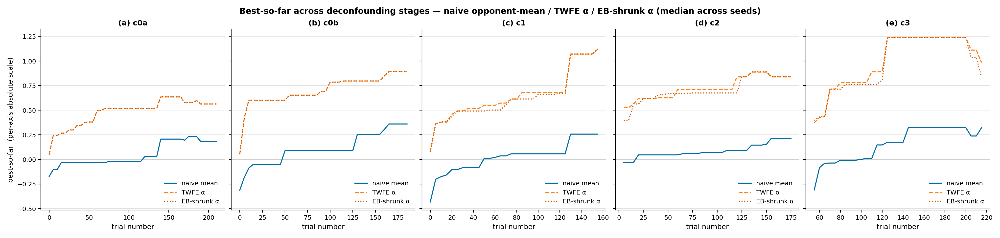
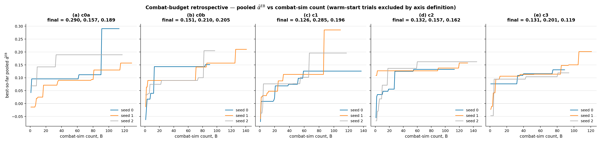
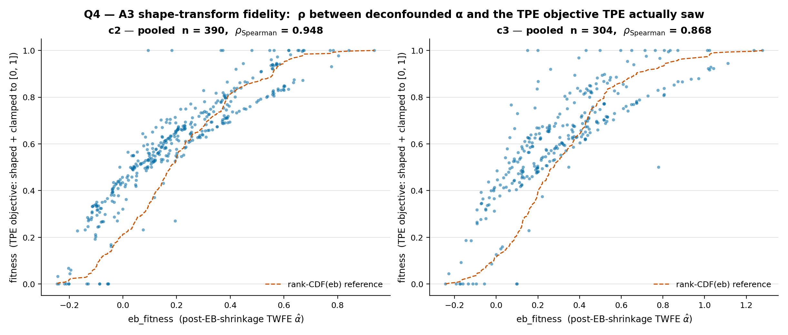
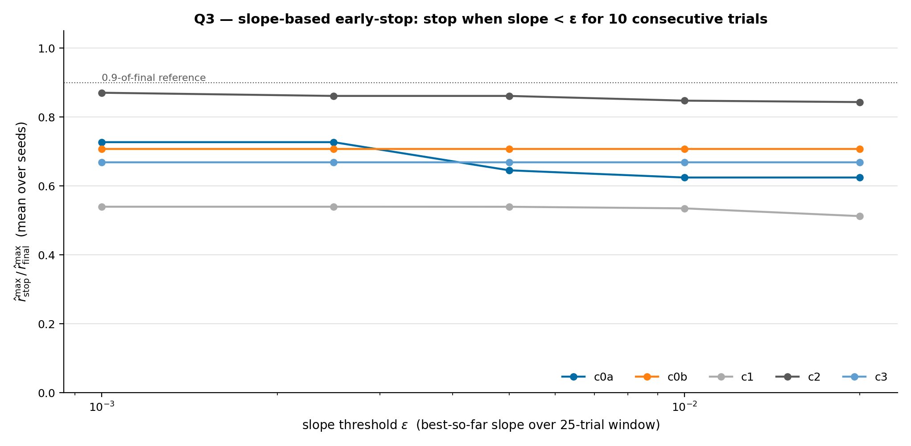

# Wave 1 — Optimization-Trajectory Analysis

> Companion to [2026-05-10-wave1-comprehensive-analysis.md](2026-05-10-wave1-comprehensive-analysis.md). The comprehensive report asks which ranker and builds look best at the end of training. This report asks how the optimizer searched: convergence, budget axes, pruner behavior, exploration, and objective-shaping fidelity.

## Abstract

Wave 1 emitted 2,374 JSONL rows: 1,744 finalized and 630 pruned, with no observable cache-hit or invalid-spec rows. On the per-study trial-number axis, c3 looks strongest late: median best per-study EB/TWFE alpha reaches 1.238 at T=150/T=200, ahead of c1 at 1.071. That axis is a process diagnostic, not a fair cross-cell build-quality comparison: c3 starts live JSONL logging at trial 53 because stock and 50 heuristic warm-start trials are already in the Optuna DB, and all cells use noisy per-study alpha estimates. On the fairer retrospective axis, combat-sim count by pooled TWFE+EB alpha, c3 is mixed early but last at B=100 and last by median final pooled alpha (0.131); the single best pooled-alpha build is c0a/seed0 at 0.290. The corrected conclusion is therefore conservative: warm-start is not justified as a default from Wave 1 trajectory data alone. Increase budget and seeds, treat c3's A3 objective fidelity loss as a warning, and let honest evaluation decide the warm-start question.

## 1. Methods

### 1.1 Data

Inputs are `data/logs/wave1-{c0a,c0b,c1,c2,c3}/hammerhead__early__tpe__seed{0,1,2}/evaluation_log.jsonl`. Each row is one logged finalized or pruned trial. Wave 1 ran before cache-hit and invalid-spec rows were emitted, so those paths are not observable in this report.

| cell | role |
|---|---|
| c0a | A0 baseline |
| c0b | A baseline with scalar-CV trim |
| c1 | EB shrinkage, no Box-Cox |
| c2 | production stack: EB + Box-Cox |
| c3 | c2 + 50 heuristic warm-start trials |

Important ledger semantics:

- `raw_fitness` is misnamed for finalized rows. It is the per-study `eb_fitness` value written by the optimizer, or TWFE alpha when EB passes through.
- `raw_mean_hp_diff` is derived by the producer from `opponent_results[*].hp_differential`; positive is better for the player/build.
- `fitness` is the shaped TPE objective after A3/Box-Cox and clamping.
- `trial_number` is an Optuna trial number, not a pure combat-sim count. It can include COMPLETE trials that are present in the study DB but absent from JSONL.

### 1.2 Axes

This report uses two different axes and keeps their interpretations separate.

**Per-study trial-number axis.** Best-so-far over `trial_number` using per-study `raw_fitness`/`eb_fitness`. This answers: what did each live optimizer run believe it had found?

**Combat-budget x pooled-alpha axis.** Best-so-far over finalized JSONL row index `B`, scored by a single pooled TWFE+EB fit over all 1,744 finalized rows. This answers: for a fixed number of logged combat evaluations, what is the best build each run found under a common cross-cell ranker?

The second axis is the primary cross-cell comparison in this report. It still excludes unlogged warm-start and stock trials by construction; it is fair for live combat spent, not a direct evaluation of the warm-start builds themselves.

### 1.3 Metrics

- **Best-so-far:** cumulative max over finalized rows; pruned rows occupy trial-number space but do not update the max.
- **Sample efficiency:** best-so-far at fixed trial-number checkpoints `T in {50,100,150,200}` or fixed combat-budget checkpoints `B in {25,50,75,100}`.
- **Time to 90%:** first trial number where best-so-far reaches 90% of that seed's final best. The producer reports both `frac_visible_rows = T90 / visible_jsonl_rows` and `frac_trial_axis = T90 / max_trial_number`.
- **Cross-seed CV:** sample standard deviation divided by mean of best-so-far across three seeds.
- **Pruner rate:** pruned rows divided by total logged rows.
- **Proposal distance:** Jaccard distance between consecutive logged proposals' hullmod sets.
- **A3 fidelity:** Spearman rho and top-K overlap between `eb_fitness` and shaped `fitness` for c2/c3 finalized rows.
- **Early-stop simulation:** stop once best-so-far slope over a 25-trial window stays below epsilon for 10 consecutive checks; report fraction of final best captured.

Reproducibility artifacts:

- Producer: `scripts/analysis/wave1_optimization_trajectory.py`
- Numbers: `data/wave1-trajectory/headline_numbers.json`
- Charts: `data/wave1-trajectory/charts/*.png`

## 2. Row Counts and Visibility

| cell | seed | rows | finalized | pruned | max trial_number |
|---|---:|---:|---:|---:|---:|
| c0a | 0 | 168 | 113 | 55 | 168 |
| c0a | 1 | 205 | 129 | 76 | 213 |
| c0a | 2 | 183 | 117 | 66 | 189 |
| c0b | 0 | 177 | 90 | 87 | 188 |
| c0b | 1 | 151 | 141 | 10 | 160 |
| c0b | 2 | 145 | 97 | 48 | 156 |
| c1 | 0 | 147 | 137 | 10 | 150 |
| c1 | 1 | 153 | 109 | 44 | 156 |
| c1 | 2 | 149 | 117 | 32 | 153 |
| c2 | 0 | 131 | 113 | 18 | 133 |
| c2 | 1 | 167 | 132 | 35 | 179 |
| c2 | 2 | 146 | 145 | 1 | 152 |
| c3 | 0 | 156 | 89 | 67 | 215 |
| c3 | 1 | 148 | 121 | 27 | 202 |
| c3 | 2 | 148 | 94 | 54 | 211 |

c3 has the large accounting offset: its first live logged trials occur after stock seeding and 50 heuristic warm-start COMPLETE trials. c2 also has a small stock-seeding offset. Therefore trial-number comparisons are useful for within-run process shape, but they should not be read as equal combat cost.

## 3. Per-Study Trial-Number Results

### 3.1 Best-so-far and sample efficiency

| cell | T=50 | T=100 | T=150 | T=200 |
|---|---:|---:|---:|---:|
| c0a | 0.380 | 0.519 | 0.635 | 0.635 |
| c0b | 0.602 | 0.786 | 0.797 | 0.893 |
| c1 | 0.492 | 0.659 | 1.071 | 1.071 |
| c2 | 0.672 | 0.675 | 0.843 | 0.843 |
| c3 | - | 0.763 | 1.238 | 1.238 |

On this per-study axis, c3 leads at T=150/T=200 and c0b leads at T=100. c3 is undefined at T=50 because its first JSONL-visible live trial is after that point. This result describes what the studies' own running estimates believed; it is not the final cross-cell build-quality ranking.

### 3.2 Deconfounding-stage check

At T=200, median best-so-far by axis:

| axis | c0a | c0b | c1 | c2 | c3 |
|---|---:|---:|---:|---:|---:|
| naive mean | 0.282 | 0.256 | 0.257 | 0.092 | 0.322 |
| TWFE alpha | 0.635 | 0.893 | 1.071 | 0.839 | 1.238 |
| EB-shrunk alpha | 0.635 | 0.893 | 1.071 | 0.843 | 1.238 |

c3 leads on all three per-study axes, but this only shows robustness within the per-study/trial-number frame. It does not resolve the per-study versus pooled-ranker disagreement in §4.

## 4. Primary Cross-Cell Retrospective: Combat Budget x Pooled Alpha

The fairer retrospective re-axes each run by logged finalized combat evaluations and scores every build by one pooled TWFE+EB ranker fit across all 1,744 finalized rows.

| cell | B=25 | B=50 | B=75 | B=100 | final best per seed |
|---|---:|---:|---:|---:|---|
| c0a | 0.096 | 0.096 | 0.112 | 0.189 | {0.290, 0.157, 0.189} |
| c0b | 0.090 | 0.090 | 0.142 | 0.157 | {0.151, 0.210, 0.205} |
| c1 | 0.076 | 0.077 | 0.126 | 0.196 | {0.126, 0.285, 0.196} |
| c2 | 0.127 | 0.127 | 0.132 | 0.138 | {0.132, 0.157, 0.162} |
| c3 | 0.095 | 0.113 | 0.114 | 0.131 | {0.131, 0.201, 0.119} |

This table narrows the c3 claim. c3 is not last at every checkpoint: it is mid-pack at B=25/B=50, fourth at B=75, and last at B=100. The important corrected finding is that c3 is last by median final pooled alpha and last at B=100. The single best pooled-alpha build is c0a/seed0 at 0.290, with c1/seed1 close at 0.285.

Interpretation: Wave 1 trajectory data does not prove warm-start is harmful, because the warm-start builds themselves are not in JSONL and honest evaluation is still the oracle. It does show that the original "c3 wins, make warm-start default" conclusion was overconfident and axis-dependent.

## 5. Convergence and Seed Variance

### 5.1 Time to 90% of final

| cell | seed | final best | T90 | visible-row frac | trial-axis frac |
|---|---:|---:|---:|---:|---:|
| c0a | 0 | 0.833 | 137 | 0.82 | 0.82 |
| c0a | 1 | 0.563 | 70 | 0.34 | 0.33 |
| c0a | 2 | 0.635 | 11 | 0.06 | 0.06 |
| c0b | 0 | 0.893 | 162 | 0.92 | 0.86 |
| c0b | 1 | 0.914 | 140 | 0.93 | 0.88 |
| c0b | 2 | 0.797 | 112 | 0.77 | 0.72 |
| c1 | 0 | 0.702 | 96 | 0.65 | 0.64 |
| c1 | 1 | 1.119 | 128 | 0.84 | 0.82 |
| c1 | 2 | 1.071 | 73 | 0.49 | 0.48 |
| c2 | 0 | 0.675 | 5 | 0.04 | 0.04 |
| c2 | 1 | 0.843 | 123 | 0.74 | 0.69 |
| c2 | 2 | 0.937 | 62 | 0.42 | 0.41 |
| c3 | 0 | 0.835 | 118 | 0.76 | 0.55 |
| c3 | 1 | 1.278 | 125 | 0.84 | 0.62 |
| c3 | 2 | 1.238 | 125 | 0.84 | 0.59 |

Nine of fifteen seeds have T90 > 100, so a hard T=100 stop would usually miss late improvements on the per-study axis. The corrected fractions show late discovery without mixing trial numbers and finalized-count denominators.

### 5.2 Cross-seed CV

| cell | CV at last finite checkpoint |
|---|---:|
| c0a | 0.206 |
| c0b | 0.072 |
| c1 | 0.236 |
| c2 | 0.162 |
| c3 | 0.219 |

c1 and c3 have the highest ceilings on the per-study axis and also high seed variance. Three seeds are not enough to make fine cross-cell ordering claims.

## 6. Pruner and Exploration Diagnostics

### 6.1 Pruner trajectory

| cell | logged rows | pruned | rate |
|---|---:|---:|---:|
| c0a | 556 | 197 | 35.4% |
| c0b | 473 | 145 | 30.7% |
| c1 | 449 | 86 | 19.2% |
| c2 | 444 | 54 | 12.2% |
| c3 | 452 | 148 | 32.7% |

Pruner rate falls from c0a through c2, then rises in c3. c3 is second-highest, not highest. This is a warning about warm-start plus the pruner, but the mechanism is not proven by this report.

### 6.2 Cache and invalid rows

Cache-hit and invalid-spec rates are zero because Wave 1 did not log those paths. This section provides no evidence about actual cache reuse or repair failures.

### 6.3 Logged search diversity

| cell | distinct logged builds per seed | mean |
|---|---|---:|
| c0a | [168, 205, 183] | 185.3 |
| c0b | [177, 151, 145] | 157.7 |
| c1 | [147, 153, 149] | 149.7 |
| c2 | [131, 167, 146] | 148.0 |
| c3 | [156, 148, 148] | 150.7 |

Among rows that were logged with build IDs, all builds are distinct. Because cache-hit rows are absent, this cannot prove TPE never re-proposed a cached build.

### 6.4 Proposal locality

| cell | mean hullmod-set Jaccard distance |
|---|---:|
| c0a | 0.684 |
| c0b | 0.675 |
| c1 | 0.706 |
| c2 | 0.720 |
| c3 | 0.670 |

Consecutive logged proposals remain far apart in hullmod-set space. This is evidence of broad exploration among logged proposals, not a direct cache/reproposal measurement.

## 7. A3 Objective Fidelity

For c2 and c3, compare deconfounded `eb_fitness` against the shaped TPE objective `fitness`.

| cell | finalized n | pooled Spearman rho | top-5 overlap | top-10 overlap | per-seed rho |
|---|---:|---:|---:|---:|---|
| c2 | 390 | 0.948 | 3 / 5 | 4 / 10 | 0.944 / 0.928 / 0.971 |
| c3 | 304 | 0.868 | 1 / 5 | 3 / 10 | 0.859 / 0.890 / 0.881 |

c3 has worse objective fidelity than c2, especially at the top of the ranking. This supports caution around the warm-start plus A3 configuration. The mechanism remains a hypothesis: the producer analyzes finalized JSONL rows and excludes the unlogged warm-start trials themselves.

## 8. Early-Stop Simulation

| cell | best mean captured fraction | min seed captured | median stop T at best epsilon |
|---|---:|---:|---:|
| c0a | 0.727 | 0.321 | 45 |
| c0b | 0.708 | 0.645 | 44 |
| c1 | 0.540 | 0.356 | 59 |
| c2 | 0.870 | 0.774 | 71 |
| c3 | 0.669 | 0.610 | 108 |

No tested slope threshold captures 90% of final best for any cell. The present trajectories improve by late jumps, so slope-based early stop is not reliable on a Wave-1-class budget.

## 9. Conclusions and Recommendations

1. Treat the combat-budget x pooled-alpha retrospective as the primary cross-cell trajectory comparison. On that axis, c3 is last at B=100 and last by median final pooled alpha, although early checkpoints are mixed.
2. Treat per-study trial-number curves as process diagnostics. They explain what each optimizer run believed, and they are useful for debugging, but they over-supported the original warm-start conclusion.
3. Do not make warm-start the default from Wave 1 trajectory data alone. Wait for honest-eval results, then run a focused warm-start ablation if the answer remains ambiguous.
4. Increase seed count. The c1/c3 cross-seed CV values near 0.22-0.24 are too high for three-seed ordering to be stable.
5. Revisit budget. Nine of fifteen seeds reach 90% of their final per-study best after T=100, and slope early-stop fails to capture 90% of final best.
6. Treat c3's A3 fidelity loss as a warning, not proof. Re-test c3 with a controlled warm-start/A3/pruner design before using it as a production default.
7. Do not publish Wave 3 cost projections from this report. V2 throughput and cost need their own validated report before budgeting decisions.

## Appendix A. File Map

- Producer: `scripts/analysis/wave1_optimization_trajectory.py`
- Headline numbers: `data/wave1-trajectory/headline_numbers.json`
- Charts: `data/wave1-trajectory/charts/`
- Input ledgers: `data/logs/wave1-{cell}/hammerhead__early__tpe__seed{seed}/evaluation_log.jsonl`
- Companion report: [2026-05-10-wave1-comprehensive-analysis.md](2026-05-10-wave1-comprehensive-analysis.md)
