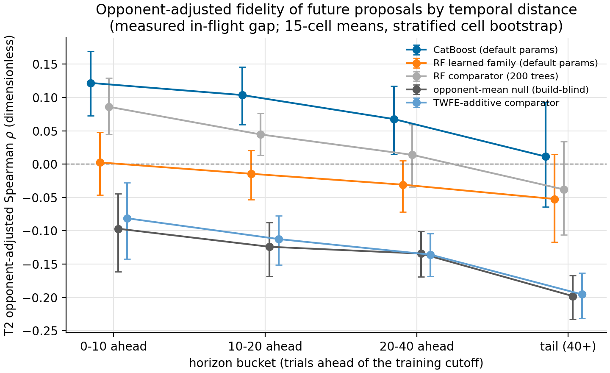
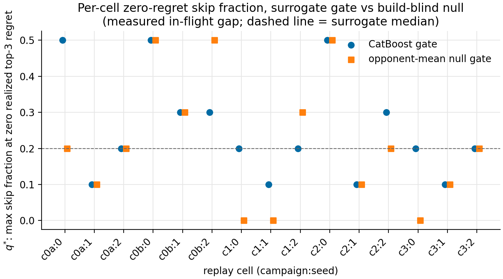

# Phase 7 — Prequential replay ablation (wave-1 stream)

## Abstract

First readings from the prequential replay instrument (roadmap item 2;
methodology review M3 remedy; spec 31 §"Prequential Replay Ablation"),
run over all 15 wave-1 replay cells locally with zero sim spend. The
predeclared headline: a CatBoost gate replayed at the measured in-flight
gap could have skipped a **median 20% of proposals (q\* = 0.2, ≈ 12.4%
of matchup rows) at zero realized top-3 regret** — but the build-blind
opponent-mean null gate posts the **same median q\* = 0.2**, so the
surrogate's *gating* advantage over panel-difficulty knowledge alone is
not established on this stream. The decisive mechanism reading is the
drift-aware opponent-adjusted fidelity (T2): CatBoost is the **only arm
with positive opponent-adjusted rank signal on future proposals**
(ρ ≈ 0.12 on the adjacent block), and on the support-balanced panel
that signal **holds roughly flat within ~40 trials ahead and collapses
to ≈ 0 beyond** — TPE-stream drift is real at the horizon the optimizer
cares about, though not the smooth per-block decay the pooled means
suggest. Raw panel-matched fidelity (T1 ≈ 0.47 vs null
0.32) is dominated by opponent-panel composition, reproducing the C1
confound prequentially. The folded Phase 5A estimator arms are
indistinguishable on the oracle direction check, as predeclared. This
report does not cover the offline MCBO bake-off (the Phase 7 gate's
second input) or any novel-build generality claim (the stream is
TPE-interpolative by construction).

## Methods

### Data

Unit of analysis: one **replay cell** = (campaign, seed) study of the
frozen wave-1 matchup DB (`data/phase7/wave1_matchups.sqlite`,
`training_matchups`: 21,362 rows, 2,374 trials, 15 cells, 5 campaigns ×
3 Optuna seeds; 1,744 finalized + 630 pruned trials). Each cell's
trials are ordered by **arrival** (eval-log `timestamp`, tie-broken by
`trial_number`) — the frozen DB's own key is Optuna suggestion order,
which is non-monotonic in arrival under parallel workers (spec 31
temporal-semantics reconciliation). Matchup rows join the eval logs on
`(source_path, trial_number)` with hard-error totality. Pruned trials
are included in training data (4–9 realized rows each; finalized trials
have 10). The **oracle panel** (`honest_eval_matchups`, 54 builds × 54
opponents × 30 replicates) contributes at most 3 oracle'd builds per
replay cell (top-3-per-seed selections); its 9 random-baseline builds
have no replay cell. Sources: `data/logs/wave1-*/…/evaluation_log.jsonl`
(15 logs), `data/study_dbs/wave1-*/…` (in-flight measurement only).

### Estimators / models

**Surrogate arms** (fit per cutoff on past rows only): the two canonical
learned families at `DEFAULT_HYPERPARAMETERS` — `catboost_regressor`
(CatBoost, native categoricals, RMSE loss, 600 iterations, depth 6,
lr 0.05) and `random_forest_tuned` (sklearn RF, 200 trees, sqrt
features) — implemented by
`scripts/analysis/phase7_learned_surrogate_experiment.py:make_model`,
plus the six comparator-gate families
(`phase7_baseline_surrogate.py:make_model`): `global_mean`,
`opponent_mean`, `build_mean`, `twfe_additive`, `ridge_hybrid`,
`random_forest`. `opponent_mean` is the mandatory build-blind null
(review C1). **No per-cutoff HPO** (predeclared: cost-prohibitive and
winner's-curse-prone at replay inner sizes; cf. M1/C3).

**Estimator arms** (per cell, fit on all rows, ranked over rankable =
finalized builds; `scripts/analysis/phase7_prequential_replay.py:
estimator_arm_estimates`, math owned by spec 28 /
`deconfounding.py`):

| Arm | Definition |
|---|---|
| A0 | TWFE α̂ (alternating projection, ridge 0.01, 20 iters), untrimmed residual mean |
| A1 | A0 with trim-worst-2 residuals (live `TWFEConfig` default) |
| A2 | `α̂_A1 − β̂_cv·(h − h̄)`, `h` = `composite_score` recomputed by the current manifest-driven scorer, `β̂_cv = Cov(α̂_A1, h)/Var(h)`, zero under the variance floor. A **reconstruction, not a replication** of the Phase-5A scalar CV (scorer has since changed; `composite_score` is inadmissible as a live covariate per Phase-7-prep). |
| EB | A1 + `eb_shrinkage` (logged 10-dim covariate vectors, finalized-only; `σ̂_i² = σ̂_ε²/n_i`, shared pooled-residual-variance helper) + triple-goal rank |
| A3 | A2 + pre-5E top-quartile ceiling: rank-vacuous except ties among the top quartile; measured only through top-k selection under seeded random tie-breaking |

The arms operate on the `hp_differential` target (spec 30 /
`posthoc_ranker` precedent), **not** the live incumbent's
`combat_fitness` (not exactly recoverable from logs) — one of the two
pinned deviations from re-groom D2's "same incumbent definition" (the
other: EB added as the shipped-incumbent arm).

### Statistical-learning setup

- **Unit of observation**: matchup row (build × opponent) for fits;
  trial for fidelity/gating.
- **Target**: `training_matchups.target` = `hp_differential` ∈ [−1, 1].
- **Prediction-target population**: each trial's **planned
  `opponent_order` panel** (10 opponents, logged at dispatch before any
  outcome, for all trials including pruned) — predicted trial score =
  mean predicted target over the planned panel. Realized row sets are
  never used for prediction (pruner-outcome leak).
- **Features**: feature schema v4, profile `all`
  (`matchup_features.py`, spec 31); pure function of (build, opponent).
- **Partition semantics**: prequential — cutoffs at trial index 40,
  stride 10, while ≥ 10 future trials remain; training = stream prefix
  minus the in-flight gap G (G = 0 optimistic; G = Ĝ, the per-cell
  median in-flight count measured from study-DB interval overlaps);
  scoring = future trials bucketed by distance (0–10, 10–20, 20–40,
  tail). No unit appears in both sides of any cutoff.
- **Fidelity targets**: **T1** = realized raw trial mean, finalized
  trials only (realized panel = planned panel → no composition
  confound); **T2** = the trial build's full-data A1 α̂
  (opponent-adjusted).
- **Leakage controls**: decision-time panels; T1 finalized-only; gating
  removes skipped trials' rows from later training (keep-rows
  sensitivity at q = 0.3); honest-eval targets appear only as
  post-fit evaluation targets (`honest_eval_usage =
  exploratory_selection`; `claim_label = exploratory`).
- **Seeds / determinism**: `hpo_seed` 23; bootstrap/tie-break seed 331;
  single-threaded RF prediction; artifact byte-identical on re-run
  (verified — see Appendix).
- **Model-selection criterion**: none — the headline statistic and all
  sensitivity labels were predeclared in spec 31 before the sweep.

### Comparison statistics

Rank fidelity: Spearman ρ and Kendall τ per (cell, cutoff, bucket, arm);
pooled as cell means with a **campaign-stratified cluster bootstrap**
(resampling unit = replay cell, stratified by campaign, 2,000
iterations, seed 331, percentile 95% CIs; descriptive — 15 clusters).
Gating: per-cell q\* = max q ∈ {0.1, 0.2, 0.3, 0.5} with zero realized
top-3 regret under the A1 target; **headline = median q\* over 15 cells
for `catboost_regressor` at G = Ĝ, with the `opponent_mean` null
alongside** (everything else sensitivity). Savings denominator includes
the pruner reference = Σ(`opponents_total` − `opponents_evaluated`)
over pruned trials. Oracle recovery: within-cell pairwise concordance
(≈ 3 pairs/cell; A3 tie-group pairs credit 0.5 exactly) with
cell-bootstrap CI; secondary campaign-level Spearman under the μ̂+α̂
alignment (n = 9/campaign, build bootstrap).

### Diagnostics & thresholds

Predeclared caveats (spec 31, verbatim): the replay measures filtering
fidelity on the logged stream and cannot measure the counterfactual TPE
trajectory had proposals actually been skipped; the stream is
forward-deployment evidence over later proposals of the *same* studies,
not novel-build or cross-hull evidence. No pass/fail threshold is
attached to the headline — it is one of the two predeclared inputs to
the Phase 7 BoTorch go/no-go (the other being the MCBO bake-off).

## Results

### 1. Stream characterization

**Method (§Data).** 15 replay cells, 131–205 trials each (2,374 total),
arrival-ordered; measured in-flight gap Ĝ ranges **8–15 trials (median
12)** — at any completion, roughly a dozen proposals were in flight, so
the "zero-gap" trainer is optimistic by about one dispatch block. The
incumbent pruner avoided 2,378 rows total (≈ 10.0% of the 23,740-row
counterfactual), the reference point for gating savings.

### 2. Panel-matched fidelity (T1) by horizon

**Method (§Statistical-learning setup, T1). Statistic: cell-mean
Spearman, stratified cell bootstrap. Support = contributing
(cell, cutoff) records.** G = Ĝ throughout; `global_mean`/`build_mean`
are degenerate for unseen builds (constant predictions) and excluded.

| Arm | 0–10 | 10–20 | 20–40 | tail |
|---|---:|---:|---:|---:|
| catboost_regressor | 0.469 [0.414, 0.528] | 0.498 [0.453, 0.544] | 0.529 [0.502, 0.554] | 0.514 [0.460, 0.568] |
| random_forest_tuned | 0.427 [0.384, 0.472] | 0.474 [0.433, 0.519] | 0.505 [0.466, 0.540] | 0.516 [0.451, 0.576] |
| random_forest (200 trees) | 0.467 [0.417, 0.515] | 0.486 [0.447, 0.528] | 0.516 [0.481, 0.549] | 0.480 [0.411, 0.546] |
| twfe_additive | 0.333 [0.292, 0.375] | 0.349 [0.302, 0.398] | 0.378 [0.317, 0.439] | 0.338 [0.259, 0.411] |
| opponent_mean (null) | 0.317 [0.270, 0.364] | 0.335 [0.287, 0.384] | 0.381 [0.319, 0.441] | 0.336 [0.257, 0.409] |
| ridge_hybrid | 0.087 [0.026, 0.146] | 0.127 [0.076, 0.185] | 0.148 [0.101, 0.198] | 0.198 [0.132, 0.259] |

Support (learned arms): 169/167/152/122 (cell, cutoff) records per
bucket; comparator arms differ by ≤ 3 records. Deeper buckets lose late
cutoffs — bucket means are not comparable without this column. In-flight-gap sensitivity (adjacent bucket,
CatBoost): G = 0 gives 0.495 vs G = Ĝ 0.469 — the honest setting costs
≈ 0.03 ρ.

**Reading.** The learned families beat the build-blind null by ≈ 0.15 ρ
on the adjacent block with non-overlapping CIs — a deployed gate would
rank upcoming proposals meaningfully better than panel difficulty
alone. But T1 does *not* decay with distance, and the null posts 0.32+
with zero build knowledge: most of T1 is opponent-panel composition
(C1's 69.8% between-opponent variance, reproduced prequentially).
The untuned 200-tree RF comparator matches the learned families at
these training sizes — default-parameter fits leave the family ranking
unresolved here.

### 3. Opponent-adjusted fidelity (T2) — the drift result

**Method (§Statistical-learning setup, T2). Statistic: cell-mean
Spearman vs full-data A1 α̂, stratified cell bootstrap.**

*Figure 1 — Opponent-adjusted rank fidelity (T2 Spearman ρ,
dimensionless) of future proposals vs temporal distance, G = Ĝ, 15-cell
means with stratified-cell-bootstrap 95% CIs. Dashed line = zero.
Pooled per-bucket means; see the balanced-panel control below before
reading a within-40 gradient.*

Pooled cell means (support 169/167/152/122, as in §2): CatBoost
**0.122 → 0.104 → 0.068 → 0.011** across buckets (the only arm positive
everywhere); RF-tuned ≈ 0; untuned RF 0.086 → −0.038; `opponent_mean`
and `twfe_additive` are **negative** (−0.10 → −0.20).

**Support-balanced control.** Deep buckets exist only at early cutoffs,
so the pooled means confound temporal distance with cutoff position and
training-set size. Restricting to cutoffs that populate **all four
buckets** (all 15 cells contribute; `headline_numbers.json`
→ `t2_balanced_panel`), CatBoost reads **0.110 → 0.126 → 0.109 →
0.011**: flat within ~40 trials ahead, then a collapse in the tail. The
apparent within-40 gradient of the pooled means is an
aggregation-composition artifact; the tail collapse and the null arms'
negative T2 (balanced: −0.08 → −0.20) are robust to the control.

**Reading.** Three load-bearing facts. (i) Once opponent effects are
removed, the surrogate's genuine build-quality signal on future
proposals is real but small — ρ ≈ 0.11–0.13 within 40 trials ahead,
from the arm that was promoted on interpolation splits. (ii) That
signal is **flat within ~40 trials and gone beyond** (balanced panel):
the forward-time adversarial AUC 0.820 shows up at deployment horizon,
but as a cliff past ~40 trials rather than a smooth per-block decay. A
deployed gate retrained at least every ~40 trials keeps its signal; a
staler surrogate is a build-blind surrogate. One alternative reading
the design cannot exclude: the tail bucket exclusively scores
late-stream (TPE-converged) trials, so range restriction among
converged proposals may contribute to the tail collapse alongside
drift. (iii) The build-blind arms' *negative* T2 is the 5C curriculum's
signature: later (better) builds faced harder panels, so panel
difficulty anti-correlates with build quality along the stream —
ranking future proposals by panel difficulty actively inverts build
quality. This is why T1's high null values overstate deployability.

Matchup-level corroboration (adjacent bucket, per-opponent rank
metrics, cell means): CatBoost mean per-opponent Spearman 0.279,
RF-tuned 0.249; the null's per-opponent Spearman is undefined by
construction (constant within opponent) — the learned families'
within-opponent signal is real but modest.

### 4. Gating simulation — savings at fixed regret

**Method (§Comparison statistics). Statistic: per-cell q\* and rows
saved; headline = median over 15 cells, CatBoost, G = Ĝ, A1 target,
top-3.**

*Figure 2 — Per-cell q\* (max skip fraction at zero realized top-3
regret under the A1 target), CatBoost vs the build-blind null, G = Ĝ.
Dashed line = CatBoost median (0.2).*

| Quantity | CatBoost | opponent_mean null |
|---|---:|---:|
| median q\* | **0.2** | 0.2 |
| mean q\* | 0.253 | 0.213 |
| cells with no zero-regret q (q\* = 0) | 0/15 | 3/15 |
| cells with top-3 regret at q = 0.1 | 1/15 | 3/15 |
| median rows saved at q\* | 12.4% | — |

Per-cell CatBoost savings at q\* range 5.9%–35.4% of realized rows
(n = 15 cells; the pruner's own 10.0% comes on top of either gate).
Zero-gap sensitivity: median q\* stays 0.2 (two cells drop to 0).
Keep-vs-remove training sensitivity at q = 0.3: total top-3 regret 11
(remove) vs 9 (keep) across cells — no material optimism from the
cheaper semantics. Gating-target sensitivity (total top-3 regret across
cells at q = 0.3): A1 = 11, A0 = 14, EB = 5 — the verdict's shape is
stable across target definitions.

**Reading.** The headline does **not** separate the surrogate gate from
the build-blind null at the median: with ~10-trial blocks and top-3
zero-regret as the bar, panel-difficulty knowledge alone "safely" skips
20% in the median cell. The surrogate's edge appears only at the
margins: it regrets at q = 0.1 in one cell (`wave1-c1:0`) versus the
null's three, and it always has *some* zero-regret q where the null has
none in three cells. Note q\*'s non-monotonicity under remove-semantics
(that same cell has zero regret at q = 0.2 but not 0.1: skipping
different trials changes later training sets and hence later
decisions) — zero-regret events are lumpy for both gates, so per-cell
q\* readings inherit the q-grid's discreteness and the luck of small
blocks for surrogate and null alike. Given (§3) the null ranks
*inversely* to build quality, its parity here is precisely the point:
this statistic, on this stream, cannot certify the surrogate's gating
value. Bigger contrasts need either more capable surrogates (better
data) or harder regret bars (top-1 is a coin flip per H3; larger k
needs longer streams).

### 5. Estimator arms (folded Phase 5A debt)

**Method (§Estimators; §Comparison statistics). Statistic: within-cell
pairwise concordance vs oracle means (direction check only — arms are
predeclared indiscriminable at this panel size).**

| Arm | concordant/pairs | fraction | cell-bootstrap 95% CI |
|---|---:|---:|---|
| A0 | 28.0/45 | 0.622 | [0.444, 0.778] |
| EB | 27.0/45 | 0.600 | [0.444, 0.733] |
| A1 | 26.0/45 | 0.578 | [0.400, 0.733] |
| A2 | 25.0/45 | 0.556 | [0.356, 0.733] |
| A3 | 22.5/45 | 0.500 | [0.500, 0.500] |

Campaign-level secondary (μ̂+α̂ alignment, n = 9 builds/campaign,
Spearman with build-bootstrap CIs): campaign means A0 0.367 / EB 0.313 /
A1 0.277 / A2 0.220 (build-bootstrap CIs span zero in **every**
campaign for all four); A3's ceiling-tied variant is erratic by
construction (+0.74 to −0.74 across campaigns). Same
direction-check-only status as the primary, same nominal ordering
(A0 first).

Prequential convergence (Spearman of arm-at-cutoff vs arm-at-full,
15-cell means): A0/A1/A2 are already ≥ 0.98 at the first cutoff (40
trials); **EB starts at 0.683 and only reaches 0.988 at the last
cutoff** — the shrinkage prior moves rankings materially while data
accumulates. A3's ceiling cost: random tie-breaking inside the top
quartile recovers only 3.7% of A2's top-1, 10.6% of top-3, 30.8% of
top-9 selections (means over cells) — the ceiling erases nearly all
top-end selection information.

**Reading.** All arms sit above 0.5 concordance except A3 (whose 0.5 is
the analytic tie expectation), with overlapping CIs — as predeclared,
n = 45 pairs of incumbent-selected builds cannot rank the arms. Three
usable signals still emerge: the trim (A0 → A1) does not help on this
check (A0 is nominally best); EB's slow convergence makes it the worst
candidate for *early*-cutoff gating targets even though its final
ranking is a competitive gating target (regret 5 vs A1's 11 in §4); and
A3's top-quartile ceiling is confirmed as pure information destruction
at the top — no future estimator stack should reintroduce it. The
defaults flip to plain TWFE (re-groom D3) stands unchallenged by this
evidence.

## Synthesis & decisions

1. **Roadmap item 2 is delivered**: the M3 instrument exists
   (deterministic, spec-contracted, re-runnable on any future DB), and
   its first readings are in. The Phase 5A debt fold is discharged with
   the two pinned deviations (target scale `hp_differential`; EB arm
   added) noted here at discharge per re-groom D2.
2. **For the Phase 7 BoTorch gate**: the surrogate carries genuine,
   positive, opponent-adjusted signal on future proposals — but it is
   small (ρ ≈ 0.11–0.13 within ~40 trials ahead on the balanced panel),
   vanishes beyond that horizon, and its zero-regret gating value is
   not separable from a build-blind null on this DB. This is the deployment-side counterpart of the
   adversarial-AUC interpolation finding, and it strengthens the
   data-first ordering: the designed data wave (balanced panels,
   off-TPE build arm) is what can raise T2, and the MCBO bake-off
   remains the gate's other input. No go/no-go is claimed here.
3. **Deployment shape, if a gate ships**: retrain at least every ~40
   trials (the balanced-panel signal horizon; per-block retraining is
   what this replay simulated and is safe), gate at conservative q
   (q = 0.1 regretted in only 1/15 cells and adds ~6% savings on top of
   the pruner's 10% — not a never-regret guarantee), and compute the
   gating target with plain TWFE (A1) or EB-at-convergence — never
   A3-style ceilings.
4. **Curriculum interaction**: the 5C curriculum makes panel difficulty
   anti-correlate with build quality along the stream. Any future
   gating policy scored on raw trial means would inherit this
   inversion; opponent adjustment of the gating *target* is mandatory
   (as done here).

## Open questions / next steps

- Can the designed data wave (roadmap item 4: opponent panel + off-TPE
  build arm) raise adjacent-block T2 above the ≈ 0.12 achieved on
  TPE-concentrated data? That number is now the pre-wave baseline.
- Does the H1 two-part censored target (roadmap item 7) improve
  planned-panel scoring, where 58.7% endpoint mass caps mean-prediction
  contrast?
- Longer streams or multi-hull waves would let the gating statistic use
  harder bars (top-3 over more candidates, larger k) that could
  separate surrogate from null.
- The MCBO bake-off (Planned phases) remains the unaddressed half of
  the BoTorch go/no-go.

## Appendix — file map

- Producer: `scripts/analysis/phase7_prequential_replay.py` (spec 31
  §"Prequential Replay Ablation"); charts:
  `scripts/analysis/phase7_replay_charts.py`.
- Raw artifact: `data/phase7/prequential_replay_2026-07-13.json`
  (gitignored; produced 2026-07-14 by the committed producer).
  Determinism verified two ways on 2026-07-14: a same-code, same-config
  single-cell double run reproduced **byte-identically**; and the two
  full 15-cell sweeps run during development (before/after the
  post-impl audit fixes) agree exactly on **every shared computed
  field** — the only differences are the added `campaign_rank`
  aggregate, one removed config-echo key, and the `code_version` stamp
  itself.
- Charts + headline numbers: `data/phase7-prequential-replay/`
  (git-tracked).
- Dependent reports:
  [2026-07-11 methodology review](2026-07-11-phase7-methodology-review.md)
  (M3 remedy discharged; C1 reproduced prequentially),
  [2026-07-12 adversarial-AUC evidence](2026-07-12-phase7-adversarial-auc-evidence.md)
  (drift-aware requirement answered),
  [2026-07-13 re-groom](2026-07-13-roadmap-regroom.md) (D2 fold
  discharged; D3 unchallenged),
  [2026-05-11 honest-eval final](2026-05-11-wave1-honest-eval-final.md)
  (oracle panel source).
